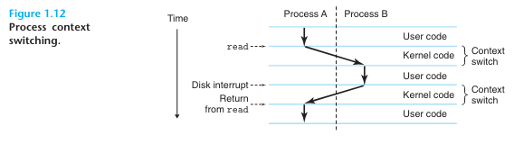

### 운영체제의 주요 목적
1. 제멋대로 동작하는 응용프로그램들이 하드웨어를 잘못 사용하는 것을 막기 위해
2. 응용프로그램들이 단순하고 균일한 매커니즘을 사용하여 다른 하드웨어 장치들을 
   조작할 수 있도록 하기 위해

운영체제는 위의 두 가지 목표를 Figure 1.11에서와 같이 근본적인 추상화를 통해 달성한다.
* 파일(File)
	* 입출력장치의 추상화
* 가상메모리(Virtual memory)
	* 메인 메모리와 디스크 입출력 장치의 추상화
* 프로세스(Process)
	* 프로세서, 메인 메모리, 입출력 장치 모두의 추상화

### 프로세스(Process)
##### 동시성 (Concurrently)
프로세스는 실행 중인 프로그램에 대한 운영체제의 추상화다.
다수의 프로세스들은 동일한 시스템에서 **동시에(Concurrently)** 실행될 수 있으며,
각 프로세스는 하드웨어를 배타적으로 사용하는 것처럼 느낀다.
즉, 한 개의 CPU가 다수의 프로세스를 동시에 실행하는 것처럼 보이게 해준다.

>[용어] 동시 (Concurrently)
>
>	한 프로세스의 인스트럭션들이 다른 프로세스의 인스트럭션들과 섞인다는 것을 의미.

##### 문맥 전환(Context Switching)
운영체제는 프로세스가 실행하는 데 필요한 모든 **상태 정보(Context)** 의 변화를 추적한다.
운영체제는 현재 프로세스에서 새 프로세스로 제어를 옮기려고 할 때 현재 프로세스의 컨텍스트를 저장하고 새 프로세스의 컨텍스트를 복원시키는 **문맥 전환**을 실행하여 제어권을 새 프로세스로 넘겨준다.

##### 예제

위 그림에는 쉘 프로세스 (Process A)와 hello 프로세스 (Process B) 두 개의 동시성 프로세스가 있다.
문맥 전환 처리 과정은 다음과 같이 진행된다.
1. 쉘 프로세스가 명령줄에서 입력을 기다린다.
2. 사용자가 hello 프로그램을 실행하라는 명령을 입력한다.
3. 쉘은 시스템 콜이라는 특수 함수를 호출하여 운영체제로 제어권을 넘긴다.
4. 운영체제는 쉘의 컨텍스트를 저장하고 hello 프로세스와 컨텍스트를 생성한 뒤 제어권을 hello 프로세스로 넘긴다.
5. hello의 처리가 종료되면 운영체제는 쉘 프로세스의 컨텍스트를 복구시키고 제어권을 넘긴다.
6. 쉘 프로세스에서 다음 명령 입력을 대기한다.

