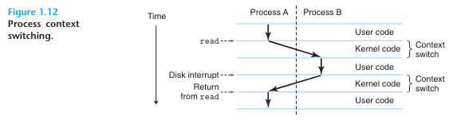

### 운영체제의 주요 목적
1. 제멋대로 동작하는 응용프로그램들이 하드웨어를 잘못 사용하는 것을 막기 위해
2. 응용프로그램들이 단순하고 균일한 매커니즘을 사용하여 다른 하드웨어 장치들을 
   조작할 수 있도록 하기 위해

운영체제는 위의 두 가지 목표를 Figure 1.11에서와 같이 근본적인 추상화를 통해 달성한다.
* 파일(File)
	* 입출력장치의 추상화
* 가상메모리(Virtual memory)
	* 메인 메모리와 디스크 입출력 장치의 추상화
* 프로세스(Process)
	* 프로세서, 메인 메모리, 입출력 장치 모두의 추상화

### 프로세스(Process)
##### 동시성 (Concurrently)
프로세스는 실행 중인 프로그램에 대한 운영체제의 추상화다.
다수의 프로세스들은 동일한 시스템에서 **동시에(Concurrently)** 실행될 수 있으며,
각 프로세스는 하드웨어를 배타적으로 사용하는 것처럼 느낀다.
즉, 한 개의 CPU가 다수의 프로세스를 동시에 실행하는 것처럼 보이게 해준다.

>[용어] 동시 (Concurrently)
>
>	한 프로세스의 인스트럭션들이 다른 프로세스의 인스트럭션들과 섞인다는 것을 의미.

##### 문맥 전환(Context Switching)
운영체제는 프로세스가 실행하는 데 필요한 모든 **상태 정보(Context)** 의 변화를 추적한다.
운영체제는 현재 프로세스에서 새 프로세스로 제어를 옮기려고 할 때 현재 프로세스의 컨텍스트를 저장하고 새 프로세스의 컨텍스트를 복원시키는 **문맥 전환**을 실행하여 제어권을 새 프로세스로 넘겨준다.

> [용어] 상태 정보 (Context)
> 
> 	PC, 레지스터 파일, 메인 메모리의 현재 값 등의 정보를 포함한 정보를 의미한다.
##### 예제

위 그림에는 쉘 프로세스 (Process A)와 hello 프로세스 (Process B) 두 개의 동시성 프로세스가 있다.
문맥 전환 처리 과정은 다음과 같이 진행된다.
1. 쉘 프로세스가 명령줄에서 입력을 기다린다.
2. 사용자가 hello 프로그램을 실행하라는 명령을 입력한다.
3. 쉘은 시스템 콜이라는 특수 함수를 호출하여 운영체제로 제어권을 넘긴다.
4. 운영체제는 쉘의 컨텍스트를 저장하고 hello 프로세스와 컨텍스트를 생성한 뒤 제어권을 hello 프로세스로 넘긴다.
5. hello의 처리가 종료되면 운영체제는 쉘 프로세스의 컨텍스트를 복구시키고 제어권을 넘긴다.
6. 쉘 프로세스에서 다음 명령 입력을 대기한다.

위의 예제와 같이 하나의 프로세스에서 다른 프로세스로의 전환은 운영체제 커널(Kernel)에 의해 관리된다.

>[용어] 커널 (Kernel)
>
>	모든 프로세스를 관리하기 위해 시스템이 이용하는 코드와 자료구조의 집합으로 메모리에 상주한다.
>	응용프로그램이 운영체제에 의한 어떤 작업을 요청하면 컴퓨터는 특정 시스템 콜을 실행하여 커널에 제어를 넘겨주는데, 이 때 커널은 요청된 작업을 수행하고 응용프로그램으로 리턴한다.
>	커널은 별도의 프로세스가 아니라는 점에 유의해야 한다.

### 쓰레드(Thread)
시스템에서 프로세스는 Thread라는 다수의 실행 유닛으로 구성되어 있다.
각각의 쓰레드는 해당 프로세스의 컨텍스트에서 실행되며 동일한 코드와 전역 데이터를 공유한다.
* 쓰레드의 장점
	* 다수의 프로세스들에서보다 데이터의 공유가 더 쉽다
	* 쓰레드가 프로세스보다 더 효율적이다.
### 가상 메모리
가상 메모리는 물리적으로 존재하지 않는 메모리를 말하며 OS가 만들어낸 논리적인 형태의 메모리를 말한다. 가상 메모리에 저장된 데이터는 실제로 물리 메모리나 하드디스크에 저장된다.
각 프로세스는 가상 주소 공간(Virtual Address Space/VAS)라는 균일한 메모리의 모습을 갖게 된다.
가상 메모리가 작동하기 위해서는 프로세서가 만들어내는 모든 주소를 하드웨어로 번역하는 등의 하드웨어와 운영체제 소프트웨어 간의 복잡한 상호작용이 필요하다.
기기본적인 아이디어로는 프로세스의 가상 메모리의 내용을 디스크에 저장하고 메인 메모리를 디스크의 캐시로 이용하는 것이다.
#### 가상 메모리 구조
* 프로그램 코드와 데이터 영역
	* 코드는 모든 프로세스들이 같은 고정 주소에서 시작한다.
	* 코드와 데이터 영역은 실행 가능 목적파일로 부터 직접 초기화된다.
* 힙 (Heap)
	* 프로세스가 실행되면서 런타임에 동적으로 크기가 늘었다 줄었다 한다.
* 공유 라이브러리
	* 프로그램 언어의 표준 라이브러리나 숳학 라이브러리와 같은 공유 라이브러리 코드와 데이터를 저장하는 영역
* 스택(Stack)
	* 힙과 마찬가지로 프로그램이 실행되는 동안에 동적으로 크기가 변한다.
	* 컴파일러가 함수 호출을 구현하기 위해 사용하는 사용자 스택은 사용자 가상 메모리 맨 위에 위치한다.
* 커널 가상 메모리
	* 주소 공간의 맨 윗부분은 커널을 위해 예약되어 있다.
	* 응용 프로그램들은 이 영역의 내용을 읽거나 쓰는 것이 금지되어있다.
	* 커널 코드 내에 정의된 함수를 직접 호출하는 것도 금지되어있다.
### 파일
파일은 연속된 바이트들을 의미한다.
디스크, 키보드, 디스플레이, 네트워크 까지 포함하는 모든 입출력 장치는 파일로 모델링한다.
리눅스에서는 모든 객체를 파일로 본다.