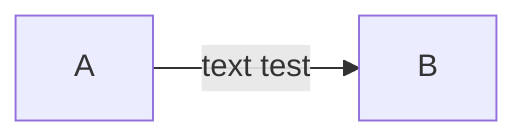

# 1. 정보는 비트와 컨텍스트로 이루어진다.
프로그램은 프로그래머가 에디터로 작성한 소스 프로그램으로 생명을 시작하며 
텍스트 파일로 저장된다.
소스 프로그램은 0 또는 1로 표시되는 비트들의 연속이며, 바이트라는 8비트 단위로 구성된다.
* ASCII - 대부분의 컴퓨터 시스템이 사용하는 텍스트 문자 표준.
* 텍스트 파일 = 오로지 ASCII 문자들로만 이루어진 파일
* 바이너리 파일 = 그 외 다른 모든 파일
## 1.2 프로그램은 다른 프로그램에 의해 다른 형태로 번역된다.
프로그래밍 언어는 인간이 이해하기 쉽기 때문에 고급 언어로 분류되며
기계어는 인간이 이해하기 어렵기 때문에 저급 언어로 분류된다.
고급 언어로 작성된 프로그램들은 저급 기계어 인스트럭션들로 번역되어야 한다.
이 인스트럭션들은 **실행가능 목적 프로그램**이라고 하는 형태로 합쳐져서 
바이너리 디스크 파일로 저장된다.

